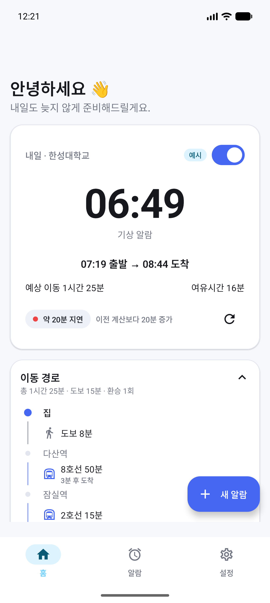
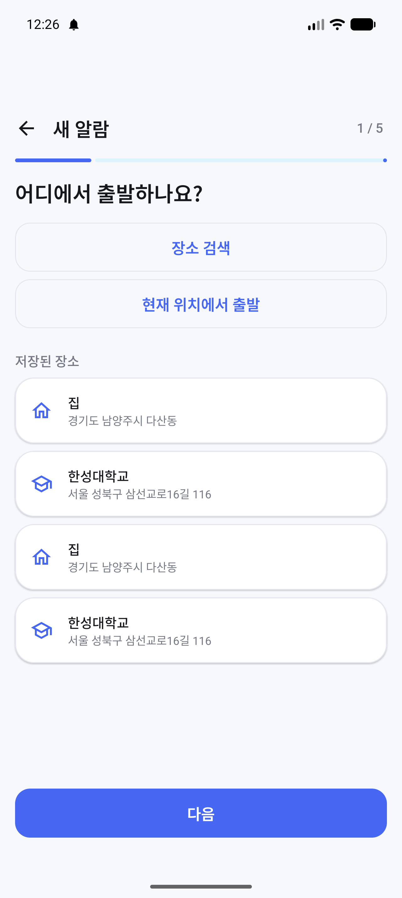
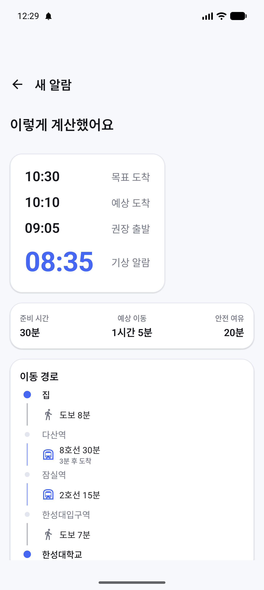
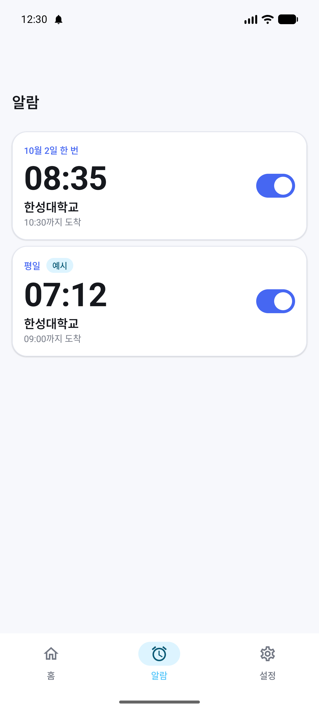
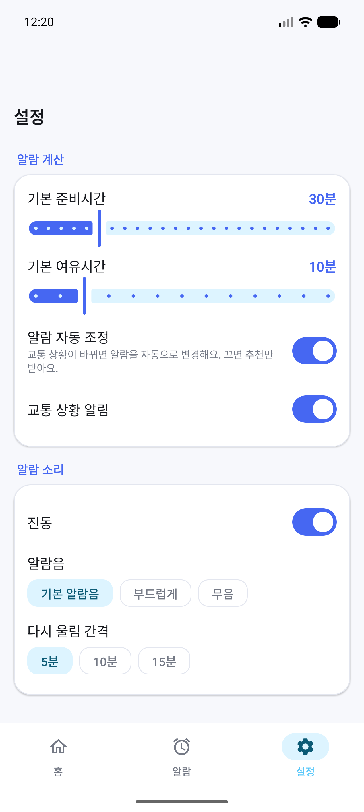

# RouteAlarm — 목표 도착 시간 기반 스마트 출발 알람

> "몇 시까지 도착하고 싶은지"만 알려주면, 대중교통 상황을 분석해 **언제 일어나야 하는지**를 계산하고 알람을 자동으로 설정·조정하는 Android 앱

Kotlin · Jetpack Compose · Clean Architecture(MVVM) · Hilt · Room · DataStore · WorkManager · AlarmManager

---

## 목차

1. [서비스 소개](#1-서비스-소개)
2. [핵심 기능](#2-핵심-기능)
3. [스크린샷](#3-스크린샷)
4. [기술 스택](#4-기술-스택)
5. [아키텍처](#5-아키텍처)
6. [알람 계산 방식](#6-알람-계산-방식)
7. [교통 정보 갱신 방식](#7-교통-정보-갱신-방식)
8. [권한 설명](#8-권한-설명)
9. [프로젝트 구조](#9-프로젝트-구조)
10. [실행 방법](#10-실행-방법)
11. [API 설정 방법](#11-api-설정-방법)
12. [테스트 방법](#12-테스트-방법)
13. [주요 설계 결정](#13-주요-설계-결정)
14. [향후 개선사항](#14-향후-개선사항)

---

## 1. 서비스 소개

일반 알람 앱은 사용자가 직접 "몇 시에 일어날지"를 계산해야 한다. RouteAlarm 은 그 계산을 대신한다.

```
출발지   경기도 남양주시 다산동
도착지   한성대학교
목표 도착 09:00
준비 시간 30분

→ 현재 예상 이동 65분, 안전 여유 10분

목표 도착 09:00
권장 출발 07:45
기상 알람 07:15
```

교통 지연으로 예상 이동시간이 15분 늘어나면 앱이 다시 계산해 알람을 **07:00** 으로 앞당기고,
"교통 상황이 변경되어 알람이 15분 앞당겨졌어요" 라고 알려준다.

## 2. 핵심 기능

| 기능 | 설명 |
|---|---|
| 자동 알람 계산 | 목표 도착 − 이동시간 − 안전 여유 − 준비시간 = 기상 알람 |
| 교통 상황 재확인 | 알람 24h / 3h / 1h / 20분 전에 WorkManager 로 재확인, 변화가 크면 알람 조정 |
| 안전한 자동 조정 | 5분 미만 변화는 무시, 30분 초과 변화는 사용자 확인, 자동 조정 OFF 시 추천만 |
| 기상 알람 + 출발 알림 | 기상 알람(전체 화면, 알람음, 진동, 스누즈)과 "10분 뒤 출발" / "지금 출발" 알림 분리 |
| Offline First | 네트워크 실패 시 Room 캐시 → 마지막 계산값으로 알람 유지, 화면에 "마지막 계산 기준" 표시 |
| 반복 일정 | 한 번 / 평일 / 매일 / 요일 직접 선택 |
| 장소 관리 | 검색, 즐겨찾기(집/학교/회사), 현재 위치 출발 |
| 재부팅·시간대 대응 | BOOT_COMPLETED / TIMEZONE_CHANGED 수신 후 알람 복구 |
| 데모 모드 | API 키 없이 Fake 교통 데이터로 전체 흐름 시연, 설정에서 가상 지연·네트워크 오류 주입 |
| 측정 지표 | API 호출/실패/캐시 적중/재계산/자동 조정 횟수를 Room 에 기록, 설정 화면에서 확인 |

## 3. 스크린샷

| 홈 | 일정 생성 | 계산 결과 | 알람 목록 | 설정 |
|---|---|---|---|---|
|  |  |  |  |  |

> `docs/screenshots/` 에 이미지를 넣으면 표시된다.

## 4. 기술 스택

| 분류 | 사용 기술 |
|---|---|
| 언어 | Kotlin 2.2, Coroutines / Flow |
| UI | Jetpack Compose, Material 3, Navigation Compose(타입 안전 라우트) |
| 아키텍처 | Clean Architecture, MVVM, UseCase, Repository Pattern |
| DI | Hilt (+ hilt-work, hilt-navigation-compose) |
| 저장 | Room (일정·장소·경로 캐시·알람 이력·지표), Preferences DataStore (사용자 설정) |
| 백그라운드 | WorkManager (교통 재확인), AlarmManager (정확한 알람), Foreground Service (알람 재생) |
| 네트워크 | Retrofit 3, OkHttp, kotlinx.serialization |
| 위치 | FusedLocationProviderClient (1회 조회만) |
| 테스트 | JUnit4, kotlinx-coroutines-test, Fake Repository |
| 빌드 | AGP 8.13, Gradle 9.2, KSP, Version Catalog |

## 5. 아키텍처

```
┌──────────────────────── presentation ────────────────────────┐
│ Compose Screen (Stateless)  ←  ViewModel (StateFlow<UiState>) │
└──────────────────────────────┬───────────────────────────────┘
                               │ UseCase 호출
┌──────────────────────────── domain ──────────────────────────┐
│ model (Schedule, AlarmPlan, TransitRoute …)                  │
│ usecase (BuildAlarmPlan, RefreshTransitTime, ScheduleAlarm …)│
│ repository 인터페이스, policy (AdjustmentPolicy …)            │
│   ※ Android 의존성 없음 → JVM 단위 테스트                     │
└──────────────────────────────┬───────────────────────────────┘
                               │ 인터페이스 구현
┌───────────────────────────── data ───────────────────────────┐
│ repository 구현 (Offline First)                               │
│ local: Room DAO, DataStore     remote: Fake / Proxy DataSource│
│ mapper: DTO·Entity ↔ Domain                                   │
└──────────────────────────────────────────────────────────────┘
┌───────────────────────────── alarm ──────────────────────────┐
│ AndroidAlarmScheduler(AlarmManager) · TransitRefreshWorker    │
│ AlarmReceiver · BootReceiver · AlarmService · Notifications   │
└──────────────────────────────────────────────────────────────┘
```

- UI 는 Retrofit/Room 을 직접 알지 못한다. `UI → ViewModel → UseCase → Repository 인터페이스 → 구현 → DataSource`.
- Repository 는 예외를 UI 로 던지지 않고 `AppResult<T>` / `AppError` 로 변환한다.
- AlarmManager·WorkManager·Notification 도 `AlarmScheduler`, `TransitRefreshScheduler`, `AlarmNotifier` 인터페이스 뒤에 숨겨 UseCase 를 JVM 에서 테스트한다.

## 6. 알람 계산 방식

`domain/usecase/BuildAlarmPlanUseCase.kt` 가 아래 UseCase 를 순서대로 조립한다.

```
travel    = EstimateTravelTime(현재 ETA, 최근 실시간 이동시간 n개)
            → max(현재, 0.7·현재 + 0.3·평균), 분 단위 올림
buffer    = CalculateSafetyBuffer(기본 여유, 지연, 실시간 여부)
            → 기본 + min(ceil(지연·0.3), 10) + (캐시 데이터면 +5)
departure = CalculateDepartureTime: target − travel − buffer
wakeUp    = CalculateWakeUpTime:   departure − preparation
```

- 모든 계산은 `Instant`(절대 시각) 위에서 한다. DST 전환일에 벽시계 시간으로 빼면 1시간 오차가 나기 때문이다.
- 권장 출발 시각이 이미 지났으면 "지금 출발" 기준으로 다시 계산해 `PlanOutcome.TooLate`(예상 도착·지각 분) 를 돌려준다.
- 반복 일정의 다음 회차는 `ResolveNextOccurrenceUseCase` 가 결정한다. 오늘 회차의 마지막 이벤트(출발 알림 또는 기상 알람)가 지나야 다음 회차로 넘어간다.

### 알람 조정 정책 (`domain/policy/AdjustmentPolicy.kt`)

| 변화량 | 동작 |
|---|---|
| 앞당김 < 5분 / 늦춤 < 10분 | 알람 유지 (ETA 노이즈 무시, 늦추는 쪽은 더 보수적) |
| 5~30분 | 자동 조정 + 알림 (설정에서 OFF 시 추천 카드만) |
| > 30분 | 사용자 확인 요청. 단 알람 1시간 이내로 남아 확인이 불가능하면 "앞당기기"만 자동 반영 |

## 7. 교통 정보 갱신 방식

```
일정 저장/활성화 ──▶ 즉시 1회 조회
                     │
                     ▼ ScheduleAlarmUseCase 가 다음 체크포인트 예약
        기상 알람 24h 전 ──▶ 3h 전 ──▶ 1h 전 ──▶ 20분 전   (WorkManager, 네트워크 필요)
                     │
                     ▼ 각 체크포인트마다 RefreshTransitTimeUseCase
        경로 조회 → 새 계획 계산 → 조정 정책 판단 → Room 저장 → AlarmManager 재등록 → 알림
```

- WorkManager 는 정확한 시각을 보장하지 않으므로 "대략 그 즈음 재확인"만 담당하고, **실제 알람은 AlarmManager** 가 담당한다.
- 일정당 하루 최대 4회만 서버를 호출한다. 몇 분마다 폴링하지 않는다.
- 네트워크 실패 시: Room 경로 캐시(24h) → 그마저 없으면 마지막 계산값으로 알람 유지 + `isRealtime=false` 표시. Worker 는 백오프로 최대 3회 재시도.
- 재부팅/시간대 변경: `BootReceiver` → `RestoreAlarmsUseCase` 가 네트워크 없이 Room 의 마지막 이동시간으로 즉시 알람을 복구하고, 실시간 갱신은 다음 체크포인트에 맡긴다.

## 8. 권한 설명

| 권한 | 용도 | 없을 때 |
|---|---|---|
| `POST_NOTIFICATIONS` (13+) | 기상 알람 Foreground 알림, 출발/교통 변경 알림 | 알림 없이 알람 화면만 표시, 설정 화면에서 상태 안내 |
| `USE_EXACT_ALARM` (13+) / `SCHEDULE_EXACT_ALARM` (12) | 계산된 시각에 정확히 울리기 위해 | 출발 알림은 근사 알람으로 대체하고 사용자에게 안내 |
| `ACCESS_COARSE/FINE_LOCATION` | "현재 위치에서 출발" 선택 시 **조회 순간 1회** | 주소 검색으로 출발지 지정 |
| `RECEIVE_BOOT_COMPLETED` | 재부팅 후 알람 복구 | — |
| `USE_FULL_SCREEN_INTENT` | 잠금화면 위 알람 화면 | — |
| `FOREGROUND_SERVICE(_MEDIA_PLAYBACK)` | 알람음 재생 | — |

권한을 요청하기 전에 온보딩 뒤 권한 화면에서 **왜 필요한지** 먼저 설명하고, 거부해도 앱은 크래시 없이 동작한다.

## 9. 프로젝트 구조

```
app/src/main/java/com/example/routealarm
├── core
│   ├── common        AppResult / AppError / Dispatcher Qualifier
│   ├── designsystem  RouteAlarmTheme, AppColors, Typography, Shapes, 공통 컴포넌트
│   └── util          TimeProvider, Duration 확장
├── domain            (Android 의존성 없음)
│   ├── model         Schedule, AlarmPlan, Place, TransitRoute, UserPreferences …
│   ├── policy        AdjustmentPolicy, BufferPolicy, RefreshCheckpointPolicy
│   ├── repository    인터페이스 (TransitRepository, AlarmScheduler …)
│   └── usecase       계산·갱신·알람 등록·일정 관리 UseCase
├── data
│   ├── local/db      Room Entity, DAO, Database
│   ├── local/datastore  Preferences DataStore
│   ├── remote        TransitRemoteDataSource 인터페이스, dto, fake/, proxy/
│   ├── mapper        DTO·Entity ↔ Domain
│   ├── repository    Offline First 구현체
│   └── location      FusedLocationRepository
├── alarm
│   ├── scheduler     AndroidAlarmScheduler (AlarmManager)
│   ├── worker        TransitRefreshWorker (WorkManager)
│   ├── receiver      AlarmReceiver, BootReceiver
│   ├── service       AlarmService (Foreground), AlarmRingingActivity
│   └── notification  채널·알림 생성
├── presentation
│   ├── navigation    Route(타입 안전), RouteAlarmApp(NavHost + BottomBar)
│   ├── home / alarmlist / settings / schedule(create, detail) / place / onboarding / permission
│   └── common        시간 포맷, 오류 메시지 매핑
└── di                Hilt 모듈 (App, Data, Network, Alarm)

app/src/test/java/com/example/routealarm
├── fake              Fake Repository / Scheduler / Notifier
└── domain            계산·정책·갱신 시나리오 단위 테스트
```

## 10. 실행 방법

1. Android Studio (Ladybug 이상, AGP 8.13 지원) 로 폴더를 연다.
2. `local.properties.example` 을 `local.properties` 로 복사하고 `sdk.dir` 을 맞춘다. (Android Studio 가 자동으로 만들어 주기도 한다)
3. 그대로 실행하면 **fake** 제공자로 동작한다. API 키 없이 모든 기능을 사용할 수 있다.

```bash
./gradlew assembleDebug
./gradlew installDebug
```

- minSdk 26 / targetSdk 36 / JDK 17 이상
- 처음 실행하면 온보딩 → 권한 안내 → 홈에 "집 → 한성대학교" 예시 일정이 꺼진 상태로 표시된다.

### 데모 시나리오 (API 키 없이)

1. 홈의 예시 일정을 켜거나 `+ 새 알람` 으로 일정을 만든다.
2. 설정 > 데모 > **가상 교통 지연** 을 20분으로 올리고 **지금 교통 정보 다시 확인** 을 누른다.
3. 홈 카드의 기상 시각이 앞당겨지고 "알람 시간이 변경됐어요" 알림이 온다.
4. 설정 > 알람 자동 조정을 끄고 같은 과정을 반복하면 변경 대신 추천 카드가 뜬다.
5. **네트워크 오류 시뮬레이션** 을 켜면 "마지막 계산 기준" 배지와 오프라인 배너가 표시되고 알람은 유지된다.

## 11. API 설정 방법

실제 교통 API 는 **Backend Proxy** 를 통해 사용한다. 앱에는 어떤 Secret 도 들어가지 않는다.

```properties
# local.properties (git 에 커밋되지 않음)
routealarm.transitProvider=proxy
routealarm.proxyBaseUrl=https://your-proxy.example.com/
```

Proxy 가 구현해야 하는 응답 형식은 [docs/proxy-api.md](docs/proxy-api.md) 에 있다.
ODsay·TMAP·공공데이터 등 어떤 제공자를 쓰든 Proxy 에서 이 형식으로 정규화하면 앱 코드는 바뀌지 않는다.

제공자를 앱 안에서 직접 구현하고 싶다면 `TransitRemoteDataSource` 를 구현하고 `di/NetworkModule.kt` 에서 바인딩만 바꾸면 된다.

## 12. 테스트 방법

```bash
./gradlew testDebugUnitTest
```

도메인 계층은 Android 의존성이 없어 JVM 에서 바로 실행된다. 현재 50개 테스트:

| 테스트 | 검증 내용 |
|---|---|
| `BuildAlarmPlanUseCaseTest` | 09:00/60분/10분/30분 → 07:20, 자정 넘김, 다음날, DST, 이동 0분, 음수 입력, 과거 목표, 지각(TooLate), 캐시 데이터 여유 |
| `CalculationUseCasesTest` | 여유시간 계산, 이동시간 안정화(가중 평균·올림), 출발/기상 계산 |
| `EvaluateAlarmAdjustmentUseCaseTest` | 5분 미만 유지, 5분 이상 자동, 늦춤 10분 기준, 30분 초과 확인, 자동 조정 OFF, 알람 직전 예외 |
| `ResolveNextOccurrenceUseCaseTest` | 반복 요일의 다음 회차, 1회 일정 날짜 결정 |
| `RefreshCheckpointPolicyTest` | 24h/3h/1h/20분 체크포인트 선택 |
| `RefreshTransitTimeUseCaseTest` | 교통 지연 → 자동 조정·알림, 작은 변화 유지, 추천/확인 요청, 추천 승인, 네트워크 실패 폴백, 알람 직전 즉시 울림 |
| `SyncScheduleUseCaseTest` | 재부팅 복구, 회차 넘김, 1회 일정 종료, 시간대 변경, 정확한 알람 권한 없음, 스누즈 보존 |

리포트: `app/build/reports/tests/testDebugUnitTest/index.html`

## 13. 주요 설계 결정

각 결정의 이유는 해당 소스의 KDoc 에도 적혀 있다.

| 결정 | 이유 |
|---|---|
| **Schedule 을 중심 개념으로, 알람 시각은 계산 결과(AlarmPlan)** | 나중에 시간표/캘린더 연동 시 Schedule 만 만들면 계산·알람·갱신 파이프라인을 재사용 (`domain/model/Schedule.kt`) |
| **Fake 를 Repository 가 아니라 RemoteDataSource 레벨에 둠** | 시연 중에도 DTO 매핑·캐시·오프라인 폴백 코드가 실제와 똑같이 동작하고 검증됨 (`data/remote/fake`) |
| **Instant 기반 계산, 표시만 ZoneId 변환** | DST/시간대 변경 시 벽시계 계산 오차 방지 (`CalculateDepartureTimeUseCase`) |
| **TimeProvider.zone() 을 매번 읽음** | `Clock.systemDefaultZone()` 은 생성 시점 Zone 을 붙잡아 여행 중 시간대 변경을 놓침 (`core/util/TimeProvider.kt`) |
| **비대칭 히스테리시스** | 앞당김은 5분, 늦춤은 10분부터 반영. 늦잠 위험 쪽을 더 보수적으로 (`AdjustmentPolicy`) |
| **30분 초과는 자동 변경 금지, 단 알람 직전은 예외** | API 오류 가능성 vs 사용자가 자고 있어 확인 불가 → 지각 방지 우선 (`EvaluateAlarmAdjustmentUseCase`) |
| **이동시간은 현재 ETA 보다 짧아지지 않게 블렌딩** | 우연히 짧게 나온 ETA 하나로 알람이 늦어지는 것을 방지 (`EstimateTravelTimeUseCase`) |
| **일정의 장소는 FK 가 아닌 스냅샷** | 즐겨찾기 삭제/수정이 이미 설정된 알람을 조용히 바꾸지 않도록 (`ScheduleEntity`) |
| **setAlarmClock 으로 기상 알람 등록** | Doze 에서도 정확, 상태바 알람 아이콘, 13+ 에서 USE_EXACT_ALARM 으로 권한 프롬프트 불필요 (`AndroidAlarmScheduler`) |
| **알람 재생은 Foreground Service, 화면은 상태만 표시** | 화면이 꺼지거나 Activity 가 종료돼도 알람이 계속 울려야 함 (`AlarmService`) |
| **WorkManager 는 재확인만, AlarmManager 가 실제 알람** | WorkManager 는 실행 시각을 보장하지 않음 (`TransitRefreshWorker`) |
| **ScheduleAlarmUseCase 는 멱등(취소 후 재등록)** | 재부팅·재계산·시간대 변경 어디서든 안심하고 호출 가능 |
| **채널 3개 분리 (알람/출발/교통)** | 사용자가 교통 알림만 끄고 기상 알람은 유지할 수 있도록 |
| **좌표 캐시 키를 100m 단위로 반올림** | 정확한 위치를 저장하지 않으면서 현재 위치 흔들림에도 캐시 재사용 |
| **API Secret 은 Backend Proxy 에만** | APK 디컴파일 유출 방지 (`docs/proxy-api.md`) |
| **Dynamic Color 미사용** | 브랜드 파란색이 기기마다 바뀌면 "대중교통 + 알람" 인상이 흐려짐 |

## 14. 향후 개선사항

- [ ] 실제 Backend Proxy 서버 구현 (ODsay/TMAP 정규화)
- [ ] 상세 화면 지도(경로 폴리라인) 표시
- [ ] 대학교 시간표 / Google Calendar 가져오기 → Schedule 자동 생성
- [ ] 알람 이력 기반 개인화 (요일·시간대별 평균 이동시간, 사용자의 실제 출발 지연 학습)
- [ ] 서버 기반 실시간 모니터링 + FCM 푸시로 WorkManager 체크포인트 사이의 급격한 변화 대응
- [ ] Compose UI 테스트, Room DAO 계측 테스트, WorkManager `TestListenableWorkerBuilder` 테스트
- [ ] Room Migration 작성 (현재는 포트폴리오 범위라 destructive migration)
- [ ] 알람 변경 Undo, 위젯, Wear OS

---

이 프로젝트는 대학 프로젝트이자 Android 개발 포트폴리오로 제작되었다.
